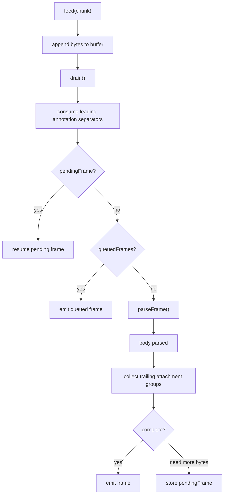

# CESR Primitives Walkthrough

## Purpose

This is a maintainers-first walkthrough of the CESR primitive layer added in the
March 4, 2026 primitive implementation/test/Serder commit arc.

Use it to answer four questions quickly:

1. What kind of thing is this primitive?
2. What does it look like in the stream?
3. How does `keri-ts` construct or parse it?
4. How close is it to the KERIpy model?

This guide is intentionally optimized for the "I need to understand this before
I touch `tufa init`" use case, not for exhaustive API reference.

## Source Anchors

- `packages/cesr/src/primitives/*`
- `packages/cesr/src/serder/serder.ts`
- `packages/cesr/src/core/types.ts`
- `packages/cesr/test/fixtures/keripy-primitive-vectors.ts`
- `packages/cesr/test/unit/primitives/*`
- KERIpy reference:
  - `keripy/src/keri/core/coring.py`
  - `keripy/src/keri/core/indexing.py`
  - `keripy/src/keri/core/counting.py`
  - `keripy/src/keri/core/structing.py`
  - `keripy/src/keri/core/serdering.py`

Parser cross-links:

- [CESR Parser Maintainer Guide](../../../design-docs/cesr/CESR_PARSER_MAINTAINER_GUIDE.md)
- [CESR Parser State Machine Contract](../../../design-docs/cesr/CESR_PARSER_STATE_MACHINE_CONTRACT.md)
- [CESR Atomic Bounded Parser Architecture](../../../design-docs/cesr/CESR_ATOMIC_BOUNDED_PARSER_ARCHITECTURE.md)

Companion scan sheet:

- [CESR Primitives KERIpy Parity Matrix](./CESR_PRIMITIVES_KERIPY_PARITY_MATRIX.md)

Active graduated-disclosure architecture docs:

- [Graduated Disclosure Maintainer Guide](../../../design-docs/cesr/GRADUATED_DISCLOSURE_MAINTAINER_GUIDE.md)
- [ADR-0007: Graduated Disclosure Workflow Boundaries](../../../adr/adr-0007-graduated-disclosure-workflow-boundaries.md)

## How To Use This Guide

1. Read the foundation section first: `Matter`, `Indexer`, `Counter`.
2. Read the parser refresher before the `Serder`/`Structor` sections.
3. Skim only the primitive families you need for the next task.
4. Use the parity matrix when comparing one symbol at a time with KERIpy.

## How To Read CESR Primitives

### One primitive, three physical views

| View   | Meaning                    | Typical use                                              |
| ------ | -------------------------- | -------------------------------------------------------- |
| `raw`  | Unqualified payload bytes  | Crypto operations, decoded body data, direct comparisons |
| `qb64` | Qualified Base64 text form | Stream text, logs, fixtures, human inspection            |
| `qb2`  | Qualified binary form      | Binary stream parsing and compact framing                |

The key mental model is simple:

- a CESR primitive is usually not "just raw bytes"
- it is raw bytes plus a derivation code that gives those bytes semantics
- the code tells you what the bytes mean and how to size/parse them

### The three base classes

| Base      | Adds                                 | Best mental model                                     | Representative example                                                                     |
| --------- | ------------------------------------ | ----------------------------------------------------- | ------------------------------------------------------------------------------------------ |
| `Matter`  | code + raw bytes                     | "qualified material in the shared matter code space"  | `ELC5L3iBVD77d_MYbYGGCUQgqQBju1o4x1Ud-z2sL-ux`                                             |
| `Indexer` | code + raw bytes + `index` / `ondex` | "qualified material in the shared indexer code space" | `AACdI8OSQkMJ9r-xigjEByEjIua7LHH3AOJ22PQKqljMhuhcgh9nGRcKnsz5KvKd7K_H9-1298F4Id1DxvIoEmCQ` |
| `Counter` | versioned framing code + count       | "genus/version-aware stream or group framing token"   | `-KAB`                                                                                     |

### Practical reading rule

When you meet an unfamiliar primitive, ask these questions in order:

1. Is it a `Matter`, an `Indexer`, or a `Counter` specialization?
2. Does it change semantics only, or does it add new structure?
3. Is it body material, attachment material, or a parser support artifact?
4. Does the parser return it directly, or does a higher-level wrapper project
   it?

## Parser Refresher

### The architecture in one sentence

The parser is an atomic, bounded-substream parser: when it sees a counted body
or group, it waits until that bounded payload is available, then parses it as
one deterministic unit instead of keeping a resumable nested parse stack.

### Terms that matter

- Frame: one emitted parser unit, historically exposed as `CesrMessage` (`body`
  plus trailing `attachments`)
- Body: the parsed body payload, exposed in TypeScript as `CesrBody`
- Attachment group: a trailing counted group after the body
- `pendingFrame`: the oldest incomplete top-level frame continuation
- `queuedFrames`: already-complete enclosed frames waiting to be emitted in
  stream order
- Framed mode: bounded one-work-unit-at-a-time emission
- Unframed mode: greedier collection before emission

### Byte flow

### Where the main body types fit

- `parseFrame()` decides whether the body is message-domain (`Serder`) or a
  CESR-native counted body/group.
- `Serder` is the main structured body object for message-domain bodies.
- `CesrBody` is the TypeScript interface for parser-emitted body objects.
- `Structor` is not a body; it is the typed wrapper for counted attachment-group
  payloads.
- Fixed-field seal/blind/media semantics now live one layer lower in
  `primitives/structing.ts` as plain records plus descriptor helpers, not as a
  second wrapper hierarchy.
- Fixed-field blind/unblind/commit workflow lives alongside those records in
  `primitives/disclosure.ts`, not on the counted-group wrappers themselves.

### The two parser workflows you will feel in practice

#### 1. Message-domain event parse

1. Parser sees `msg` cold start or message body semantics.
2. Body bytes are reaped as one Serder body.
3. `parseSerder(...)` decodes JSON / MGPK / CBOR into a `Serder` subclass.
4. Trailing attachment groups are parsed separately.
5. If needed, `Serder.projectStructors(message)` projects those attachments into
   typed `Sealer`, `Blinder`, `Mediar`, or `Aggor` wrappers.
6. For KERI seal lists, `SerderKERI.seals` stays raw-SAD-first while
   `sealRecords` / `eventSeals` provide explicit CESR structing projections.

#### 2. Native counted-group parse

1. Parser sees a versioned `Counter` that says what kind of group follows.
2. The group parser waits for the full counted payload span.
3. The payload is parsed atomically into primitives, tuples, or nested groups.
4. For map bodies, `Mapper` / `Compactor` syntax and interpretation helpers
   build labeled field projections.

## Workflow Slices

### Signing and verification

- `Signer` holds seed material.
- `Verfer` holds the public verification key.
- `Cigar` is an unindexed signature.
- `Siger` is an indexed signature and therefore extends `Indexer`.
- `Counter` groups are what tell the parser how many signatures follow in an
  attachment group.

### Seals and attachment projections

- `CounterGroup` is the parser's generic "counted group plus hydrated items".
- `Structor` wraps that group into a deterministic typed object.
- `Sealer`, `Blinder`, `Mediar`, and `Aggor` are `Structor` specializations.
- `Serder.projectStructors(...)` is the TypeScript bridge from parsed
  attachments to typed group families.
- `structing.ts` is the semantic fixed-field layer for seals, blind-state, and
  media records; the `SerderKERI` boundary stays raw-SAD-first and exposes
  explicit typed projections instead of converting every raw list entry eagerly.
- `disclosure.ts` is the fixed-field workflow layer for deterministic UUID
  derivation, commitment recomputation, and blind/unblind helpers.

### Recovery and compatibility

- `UnknownPrimitive` is how the parser stays lossless on unsupported or opaque
  payloads in fallback paths.
- This is a TypeScript-friendly explicit placeholder instead of silently
  discarding bytes.

## Primitive Catalog

## Foundation

### Matter

**What it is:** The base class for non-indexed qualified CESR material. If a
primitive is "just qualified bytes with a code", it usually starts here.

**What it looks like:** Representative `qb64` forms include
`ELC5L3iBVD77d_MYbYGGCUQgqQBju1o4x1Ud-z2sL-ux` (`Diger`) and
`BKxy2sgzfplyr-tgwIxS19f2OchFHtLwPWD3v4oYimBx` (`Prefixer`).

**How you construct/parse it in `keri-ts`:** Use `new Matter({ qb64 })`,
`new Matter({ raw, code })`, or `parseMatter(input, "txt" | "bny")`.

**Where it shows up in workflow:** Everywhere. Most derived cryptographic and
semantic primitives are thin `Matter` specializations.

**KERIpy comparison:** Direct peer is `keri.core.coring.Matter`. The TypeScript
shape is intentionally narrower and more explicit, but the core role is the
same: exfil/infil between raw material and qualified CESR encodings.

**Common gotchas / maintainer notes:** If you understand `Matter.code`,
`Matter.raw`, `Matter.qb64`, and `Matter.qb2`, most of the rest of the primitive
layer becomes category theory rather than magic.

### Indexer

**What it is:** The base class for qualified material that also carries index
metadata.

**What it looks like:** A representative indexed signature token is
`AACdI8OSQkMJ9r-xigjEByEjIua7LHH3AOJ22PQKqljMhuhcgh9nGRcKnsz5KvKd7K_H9-1298F4Id1DxvIoEmCQ`.

**How you construct/parse it in `keri-ts`:** Use `new Indexer({ qb64 })`,
`new Indexer({ raw, code, index, ondex })`, or
`parseIndexer(input, "txt" | "bny")`.

**Where it shows up in workflow:** Indexed signatures and other attachment
material where position within a signing or attachment set matters.

**KERIpy comparison:** Direct peer is `keri.core.indexing.Indexer`. The mental
model is one-to-one: it is `Matter` plus `index` / `ondex`.

**Common gotchas / maintainer notes:** `index` and `ondex` are not the same
thing. When reading signature code paths, always confirm whether the code family
expects both, one, or a defaulted match.

### Counter

**What it is:** The base framing primitive for counted CESR groups.

**What it looks like:** `-KAB` means a v2 controller-indexed-signatures counter
with count `1`. `--AAAAQA` is a larger v2 generic-group counter.

**How you construct/parse it in `keri-ts`:** Use
`new Counter({ code, count, version })` for explicit construction, or
`parseCounter(input, version, "txt" | "bny")` when parsing a stream.

**Where it shows up in workflow:** Everywhere the parser needs to know what kind
of counted payload follows, how many items it contains, and which versioned
counter codex to use.

**KERIpy comparison:** Direct peer is `keri.core.counting.Counter`. The role is
the same, including explicit version-sensitive code table lookup.

**Common gotchas / maintainer notes:** `Counter` is not just "a size prefix".
Its code name is semantic, versioned, and often tells the parser which
sub-parser to dispatch to next.

## Message And Group Projection Types

### Serder

**What it is:** The main structured body object for parsed message-domain
bodies. It carries raw body bytes plus decoded projections like `ked`, `ilk`,
and `said`.

**What it looks like:** Not a standalone CESR token. A human-readable example is
the body of a KERI event such as a JSON message beginning with a version string
field and event fields like `t`, `d`, and `i`.

**How you construct/parse it in `keri-ts`:** Typical entrypoint is
`parseSerder(raw, smellage)`. In normal parser use, `Serder` is produced by the
parser rather than directly constructed by application code.

**Where it shows up in workflow:** Top-level message parsing, especially KERI
and ACDC event bodies. This is the body object you inspect before looking at
attachments.

**KERIpy comparison:** Direct peer is `keri.core.serdering.Serder`. The core
role matches, but `keri-ts` keeps the projection shape more explicitly typed for
maintainers.

**Common gotchas / maintainer notes:** `Serder` is about body serialization and
projection. It is not the same thing as trailing attachments, even when those
attachments are later projected through `Serder.projectStructors(...)`.

### SerderKERI

**What it is:** `Serder` subtype constrained to KERI protocol bodies.

**What it looks like:** A parsed KERI event body with `proto === "KERI"`.

**How you construct/parse it in `keri-ts`:** Usually obtained from
`parseSerder(...)` when smellage says the body is KERI.

**Where it shows up in workflow:** KEL and `kli`/`tufa` flows where the body is
specifically a KERI event message.

**KERIpy comparison:** Direct peer is `keri.core.serdering.SerderKERI`.

**Common gotchas / maintainer notes:** Treat it as a protocol-specific
refinement, not a different serialization mechanism.

### SerderACDC

**What it is:** `Serder` subtype constrained to ACDC protocol bodies.

**What it looks like:** A parsed ACDC body with `proto === "ACDC"`.

**How you construct/parse it in `keri-ts`:** Usually obtained from
`parseSerder(...)` when smellage says the body is ACDC.

**Where it shows up in workflow:** Credential-body parsing and ACDC-oriented
tooling.

**KERIpy comparison:** Direct peer is `keri.core.serdering.SerderACDC`.

**Common gotchas / maintainer notes:** Same core parser pipeline, different
protocol semantics.

### CesrBody

**What it is:** The TypeScript interface for a parsed body emitted by the
parser.

**What it looks like:** A structured object with `raw`, `ked`, `kind`, `proto`,
`pvrsn`, `gvrsn`, `ilk`, `said`, and optional `native` fields.

**How you construct/parse it in `keri-ts`:** You usually do not construct it
directly. Parser and Serder code produce values conforming to this interface.

**Where it shows up in workflow:** Parser outputs, adapter boundaries, and any
consumer that wants a stable body contract independent of the concrete body
subclass.

**KERIpy comparison:** This is the main TypeScript-local divergence. KERIpy has
the same underlying body concepts through `Serder` and decoded message/body
semantics, but not this exact public interface shape.

**Common gotchas / maintainer notes:** Do not hunt for a one-to-one KERIpy class
here. Treat `CesrBody` as the TypeScript public contract layered on top of the
same underlying Serder/body model.

### Structor

**What it is:** The base typed wrapper for counted CESR tuple/list attachment
structures.

**What it looks like:** Representative enclosed group example:
`-WANYOCSRCAAEHYFmR_QWCLz8gZyhc4BQ8xJ-ftZ6OA4fNmuu1ZAvyTE`.

**How you construct/parse it in `keri-ts`:** Use
`parseStructor(input, version, cold)` for direct parsing or
`Structor.fromGroup(group)` when you already have a parser-produced
`CounterGroupLike`.

**Where it shows up in workflow:** Typed attachment handling for seals,
blinders, media wrappers, and aggregate groups.

**KERIpy comparison:** Direct peer is `keri.core.structing.Structor`.

**Common gotchas / maintainer notes:** `Structor` is about deterministic group
serialization and typed payload members. It is not a replacement for `Counter`;
it sits on top of a parsed group, and it is not the owner of fixed-field
disclosure semantics.

### CounterGroup

**What it is:** Parser-facing wrapper of `Counter` plus raw counted payload and
hydrated child entries.

**What it looks like:** Conceptually "a `Counter` plus parsed `items`". It is
not generally treated as a human-authored standalone token.

**How you construct/parse it in `keri-ts`:** Usually created internally by
group-dispatch parsing, then wrapped by `Structor` or consumed directly.

**Where it shows up in workflow:** Parser attachment graphs and native grouped
payloads.

**KERIpy comparison:** Near-parity conceptually, but the TypeScript shape is a
parser-facing explicit wrapper rather than a direct public KERIpy class surface.

**Common gotchas / maintainer notes:** If your code wants semantic meaning,
project it to `Structor` or inspect the `code` and `items`; do not stop at
`CounterGroup`.

### UnknownPrimitive

**What it is:** A lossless placeholder for unsupported or opaque CESR units
encountered during parse.

**What it looks like:** Whatever bytes were encountered, preserved as `qb64`,
`qb2`, and `raw`.

**How you construct/parse it in `keri-ts`:** Usually created via
`UnknownPrimitive.fromPayload(...)` in parser fallback paths.

**Where it shows up in workflow:** Recovery, compatibility, and lossless
roundtrip behavior for streams the current implementation does not fully
understand.

**KERIpy comparison:** TypeScript-local convenience. KERIpy has similar fallback
concerns but not this exact explicit placeholder type in the same public shape.

**Common gotchas / maintainer notes:** This type exists to preserve bytes, not
to provide semantic interpretation.

## Core Derived `Matter` Family

### Diger

**What it is:** Digest material.

**What it looks like:** `ELC5L3iBVD77d_MYbYGGCUQgqQBju1o4x1Ud-z2sL-ux`.

**How you construct/parse it in `keri-ts`:** `new Diger({ qb64 })` or
`parseDiger(input, cold)`.

**Where it shows up in workflow:** SAIDs, event digests, seals, and hash-based
identity material.

**KERIpy comparison:** Direct peer is `keri.core.coring.Diger`.

**Common gotchas / maintainer notes:** Many higher-level primitives depend on a
digest but are not themselves `Diger`.

### Prefixer

**What it is:** Identifier-prefix material.

**What it looks like:** `BKxy2sgzfplyr-tgwIxS19f2OchFHtLwPWD3v4oYimBx`.

**How you construct/parse it in `keri-ts`:** `new Prefixer({ qb64 })` or
`parsePrefixer(input, cold)`.

**Where it shows up in workflow:** Identifier prefixes in KERI events, seals,
and database keys.

**KERIpy comparison:** Direct peer is `keri.core.coring.Prefixer`.

**Common gotchas / maintainer notes:** Prefixer semantics are narrower than
generic `Matter`; valid prefix codes are a semantic subset.

### Verfer

**What it is:** Public verification-key material.

**What it looks like:** `1AAJA3cK_P2CDlh-_EMFPvyqTPI1POkw-dr14DANx5JEXDCZ`.

**How you construct/parse it in `keri-ts`:** `new Verfer({ qb64 })` or
`parseVerfer(input, cold)`.

**Where it shows up in workflow:** Signature verification, signer relationships,
and KEL key-state reasoning.

**KERIpy comparison:** Direct peer is `keri.core.coring.Verfer`.

**Common gotchas / maintainer notes:** Verification-key material is not the same
as identifier-prefix material, even when both are derived from keys. In the
current port `Verfer` also owns `verify(sig, ser)` and transferability
inspection, so higher layers should not re-dispatch suites themselves.

### Saider

**What it is:** Self-addressing identifier digest material.

**What it looks like:** `EMRvS7lGxc1eDleXBkvSHkFs8vUrslRcla6UXOJdcczw`.

**How you construct/parse it in `keri-ts`:** `new Saider({ qb64 })` or
`parseSaider(input, cold)`.

**Where it shows up in workflow:** Message `d` fields, ACDC SAIDs, and
digest-addressed content.

**KERIpy comparison:** Direct peer is `keri.core.coring.Saider`.

**Common gotchas / maintainer notes:** It is a specialized digest primitive, so
useful intuition starts with `Diger`.

### Seqner

**What it is:** Sequence-number material.

**What it looks like:** `0AAAAAAAAAAAAAAAAAAAAAAF`.

**How you construct/parse it in `keri-ts`:** `new Seqner({ qb64 })` or
`parseSeqner(input, cold)`.

**Where it shows up in workflow:** Event sequence numbers, seals, and replay
ordering.

**KERIpy comparison:** Direct peer is `keri.core.coring.Seqner`.

**Common gotchas / maintainer notes:** It is still a `Matter` token, not an
integer literal; the qualified form carries its own parsing rules.

### NumberPrimitive

**What it is:** Qualified numeric material.

**What it looks like:** `MPd_`.

**How you construct/parse it in `keri-ts`:** `new NumberPrimitive({ qb64 })` or
`parseNumber(input, cold)`.

**Where it shows up in workflow:** Numeric fields that CESR encodes as qualified
material rather than plain JSON numbers.

**KERIpy comparison:** Direct peer is `keri.core.coring.Number`.

**Common gotchas / maintainer notes:** The TypeScript name is `NumberPrimitive`
to avoid clashing with JavaScript's built-in `Number`.

### Tholder

**What it is:** Threshold material layered over qualified numeric semantics.

**What it looks like:** `MPd_` when the threshold is a simple numeric threshold.

**How you construct/parse it in `keri-ts`:** `parseTholder(input, cold)` is the
usual entrypoint.

**Where it shows up in workflow:** Key-threshold interpretation for KERI events
and signing-state validation.

**KERIpy comparison:** Direct peer is `keri.core.coring.Tholder`.

**Common gotchas / maintainer notes:** A threshold may reuse number-family
encoding while carrying different semantics at the application layer.

### Verser

**What it is:** Protocol/version tag material.

**What it looks like:** `YKERICAA`.

**How you construct/parse it in `keri-ts`:** `new Verser({ qb64 })` or
`parseVerser(input, cold)`.

**Where it shows up in workflow:** Version-bearing semantics and protocol/domain
labeling.

**KERIpy comparison:** Direct peer is `keri.core.coring.Verser`.

**Common gotchas / maintainer notes:** `Verser` is a semantic `Tagger`
specialization, not a second version-string parser.

### Ilker

**What it is:** Event-ilk tag material.

**What it looks like:** `Xicp`.

**How you construct/parse it in `keri-ts`:** `new Ilker({ qb64 })` or
`parseIlker(input, cold)`.

**Where it shows up in workflow:** Event type tagging such as `icp`, `rot`, and
related KERI message types.

**KERIpy comparison:** Direct peer is `keri.core.coring.Ilker`.

**Common gotchas / maintainer notes:** It is semantically stronger than a
generic tag because the allowed values are event ilks.

### Traitor

**What it is:** Trait tag material.

**What it looks like:** `0KEO`.

**How you construct/parse it in `keri-ts`:** `new Traitor({ qb64 })` or
`parseTraitor(input, cold)`.

**Where it shows up in workflow:** Trait flags such as establishment-only and
other KERI trait tags.

**KERIpy comparison:** Direct peer is `keri.core.coring.Traitor`.

**Common gotchas / maintainer notes:** Another `Tagger` specialization; the code
shape alone does not tell you the semantic domain unless you know the subclass.

### Tagger

**What it is:** Generic tag material.

**What it looks like:** `0J_z`.

**How you construct/parse it in `keri-ts`:** `new Tagger({ qb64 })` or
`parseTagger(input, cold)`.

**Where it shows up in workflow:** Small tag-like fields and the base class for
`Verser`, `Ilker`, and `Traitor`.

**KERIpy comparison:** Direct peer is `keri.core.coring.Tagger`.

**Common gotchas / maintainer notes:** When maintainers say "tag", confirm
whether they mean the base `Tagger` family or one of its semantic subclasses.

### Labeler

**What it is:** Qualified field-label material.

**What it looks like:** `0J_i` for label `i`, or `1AAP` for the empty label.

**How you construct/parse it in `keri-ts`:** `new Labeler({ qb64 })` or
`parseLabeler(input, cold)`.

**Where it shows up in workflow:** Native map-body parsing and mapper syntax.

**KERIpy comparison:** Direct peer is `keri.core.coring.Labeler`.

**Common gotchas / maintainer notes:** Labeler is central to native map parsing;
it is not just "metadata". Parser correctness for map bodies depends on it.

### Texter

**What it is:** Qualified text/byte-string material.

**What it looks like:** `4BABAAAA`.

**How you construct/parse it in `keri-ts`:** `new Texter({ qb64 })` or
`parseTexter(input, cold)`.

**Where it shows up in workflow:** Text payloads embedded in CESR material and
some wrapper/group families.

**KERIpy comparison:** Direct peer is `keri.core.coring.Texter`.

**Common gotchas / maintainer notes:** Keep the semantic distinction clear
between text payloads and label/tag payloads even when the encodings feel
similar.

### Bexter

**What it is:** Base64-only text-like material.

**What it looks like:** `4AABabcd`.

**How you construct/parse it in `keri-ts`:** `new Bexter({ qb64 })` or
`parseBexter(input, cold)`.

**Where it shows up in workflow:** Base64-string payloads and path-like tokens.

**KERIpy comparison:** Direct peer is `keri.core.coring.Bexter`.

**Common gotchas / maintainer notes:** `Bexter` and `Texter` are adjacent but
not interchangeable semantic families.

### Pather

**What it is:** Path material.

**What it looks like:** `4AABabcd`.

**How you construct/parse it in `keri-ts`:** `new Pather({ qb64 })` or
`parsePather(input, cold)`.

**Where it shows up in workflow:** SAD path groups, rooted path attachment
structures, and mapper/group traversal.

**KERIpy comparison:** Direct peer is `keri.core.coring.Pather`.

**Common gotchas / maintainer notes:** Like `Tholder`, `Pather` may reuse an
underlying encoding family but carry distinct semantics.

### Dater

**What it is:** Qualified datetime material.

**What it looks like:** `1AAG2023-02-07T15c00c00d025640p00c00`.

**How you construct/parse it in `keri-ts`:** `new Dater({ qb64 })` or
`parseDater(input, cold)`.

**Where it shows up in workflow:** Timestamp-bearing attachment and replay
structures.

**KERIpy comparison:** Direct peer is `keri.core.coring.Dater`.

**Common gotchas / maintainer notes:** The textual projection matters; this was
one of the parity areas explicitly hardened during the primitive-first pass.

### Noncer

**What it is:** Nonce material.

**What it looks like:** `0AAxyHwW6htOZ_rANOaZb2N2`.

**How you construct/parse it in `keri-ts`:** `new Noncer({ qb64 })` or
`parseNoncer(input, cold)`.

**Where it shows up in workflow:** Randomized challenge/nonce-bearing flows and
nonce-family semantics layered over digest/salt material.

**KERIpy comparison:** Direct peer is `keri.core.coring.Noncer`.

**Common gotchas / maintainer notes:** Nonce semantics are stricter than "any
digest-looking token".

### Decimer

**What it is:** Decimal numeric material.

**What it looks like:** `6HABAAA0`, `4HAC12345678`, or `5HADAA12p3456789`.

**How you construct/parse it in `keri-ts`:** `new Decimer({ qb64 })` or
`parseDecimer(input, cold)`.

**Where it shows up in workflow:** Decimal-preserving numeric representations
where exact textual/semantic form matters.

**KERIpy comparison:** Direct peer is `keri.core.coring.Decimer`.

**Common gotchas / maintainer notes:** Decimal semantics are not the same as
generic number semantics; do not flatten them together in docs or code review.

### Salter

**What it is:** Salt material.

**What it looks like:** `0AAwMTIzNDU2Nzg5YWJjZGVm`.

**How you construct/parse it in `keri-ts`:** `new Salter({ qb64 })` or
`parseSalter(input, cold)`.

**Where it shows up in workflow:** Key derivation and secret material bootstrap.

**KERIpy comparison:** Direct peer is `keri.core.coring.Salter`.

**Common gotchas / maintainer notes:** Salt material is secret-bearing input
material, not public identifier or verifier material. In the current port
`Salter` also owns deterministic `stretch(...)`, `signer(...)`, and
`signers(...)`, so app code should not duplicate derivation logic in manager
helpers.

### Signer

**What it is:** Signing-seed material.

**What it looks like:** `QDWGyaBNM2eF1eRq2mLwVMWl9DI_RsuSIwfg4nm35fUK` or
`JH-YCjvkRdeMyXmh7iYgnBdxFqum1vFqAeezzv7ibAYI`.

**How you construct/parse it in `keri-ts`:** `new Signer({ qb64 })`.

**Where it shows up in workflow:** Seed material for deriving signing keys and
pairing with `Verfer`.

**KERIpy comparison:** Direct peer in spirit is the executable signer model in
`keri.core.signing.Signer`, even though KERIpy's implementation lives outside
`coring.py`.

**Common gotchas / maintainer notes:** `Signer` now owns `.verfer`,
transferability semantics, `Signer.random(...)`, and suite-driven `sign(...)`.
`Manager` should orchestrate stored signers, not recreate signer suite logic
above the primitive.

### Encrypter

**What it is:** Public encryption-key material.

**What it looks like:** `CAF7Wr3XNq5hArcOuBJzaY6Nd23jgtUVI6KDfb3VngkR`.

**How you construct/parse it in `keri-ts`:** `new Encrypter({ qb64 })`.

**Where it shows up in workflow:** Envelope encryption and encrypted secret
exchange.

**KERIpy comparison:** Near-parity to KERIpy's encrypter material model.

**Common gotchas / maintainer notes:** It validates the code family; actual
crypto operations live above or beside the raw primitive wrapper.

### Decrypter

**What it is:** Private decryption-key material.

**What it looks like:** `OLCFxqMz1z1UUS0TEJnvZP_zXHcuYdQsSGBWdOZeY5VQ`.

**How you construct/parse it in `keri-ts`:** `new Decrypter({ qb64 })`.

**Where it shows up in workflow:** The private-key side of decryption flows.

**KERIpy comparison:** Near-parity to KERIpy's decrypter material model.

**Common gotchas / maintainer notes:** Like `Signer`, the primitive class is a
validated wrapper, not the whole cryptographic workflow.

### Cipher

**What it is:** Ciphertext material.

**What it looks like:** A representative unit-test token is `4CAAAAAA`; actual
values vary with ciphertext family and size.

**How you construct/parse it in `keri-ts`:** `new Cipher({ qb64 })`.

**Where it shows up in workflow:** Encrypted payload carriage rather than key
material.

**KERIpy comparison:** Near-parity to KERIpy's cipher-family material semantics.

**Common gotchas / maintainer notes:** Ciphertext primitives and key primitives
live in the same qualified-material world, but they answer very different
questions.

### Cigar

**What it is:** Unindexed signature material.

**What it looks like:**
`0ICM-rRAAdKrSrzFlouiZXbNUZ07QMM1IXOaG-gv4TAo4QeQCKZC1z82jJYy_wFkAxgIhbikl3a-nOTXxecF2lEj`.

**How you construct/parse it in `keri-ts`:** `new Cigar({ qb64 })` or
`parseCigar(input, cold)`.

**Where it shows up in workflow:** Signature carriage when index metadata is not
part of the protocol need.

**KERIpy comparison:** Direct peer is `keri.core.coring.Cigar`.

**Common gotchas / maintainer notes:** `Cigar` is not an `Indexer`. If the
protocol needs attachment position metadata, you want `Siger` instead. `Cigar`
may also carry an in-memory `verfer` reference in the same way KERIpy uses
detached signatures during reply/non-transferable flows.

## Indexed Signature Family

### Siger

**What it is:** Indexed signature material.

**What it looks like:**
`AACdI8OSQkMJ9r-xigjEByEjIua7LHH3AOJ22PQKqljMhuhcgh9nGRcKnsz5KvKd7K_H9-1298F4Id1DxvIoEmCQ`.

**How you construct/parse it in `keri-ts`:** `new Siger({ qb64 })` or
`parseSiger(input, cold)`.

**Where it shows up in workflow:** Controller and witness indexed signatures in
attachment groups.

**KERIpy comparison:** Direct peer is `keri.core.indexing.Siger`.

**Common gotchas / maintainer notes:** The class is simple; the hard part is the
protocol around which counter declared the number and interpretation of the
following `Siger`s.

## Counted-Group Structor Family

Before the counted-group wrappers, `keri-ts` now also has the fixed-field
named-value layer from `keri.core.structing` in
`packages/cesr/src/primitives/structing.ts`. That module owns `SealDigest`,
`SealEvent`, `BlindState`, `BoundState`, `TypeMedia`, and the KERIpy-style
clan/cast/coden registries as plain frozen records with companion descriptor
helpers. The fixed-field workflow verbs live separately in
`packages/cesr/src/primitives/disclosure.ts`. The counted-group classes below
still own the enclosed counter-group framing on top of those fixed-field values.

### Sealer

**What it is:** Typed seal-group wrapper.

**What it looks like:**
`-WANYOCSRCAAEHYFmR_QWCLz8gZyhc4BQ8xJ-ftZ6OA4fNmuu1ZAvyTE`.

**How you construct/parse it in `keri-ts`:** `parseSealer(input, version, cold)`
or `Sealer.fromGroup(group)`.

**Where it shows up in workflow:** Digest seals, source seals, registrar/backer
seals, and similar attachment seal payloads.

**KERIpy comparison:** Direct peer is `keri.core.structing.Sealer`.

**Common gotchas / maintainer notes:** Seal code families are numerous; always
read the counter code name, not just the fact that it is "some seal".

### Blinder

**What it is:** Typed wrapper for blind-state / blinded payload groups.

**What it looks like:**
`-aAjEBTAKXL5si31rCKCimOwR_gJTRmLaqixvrJEj5OzK769aJte0a_x8dBbGQrBkdYRgkzvFlQss3ovVOkUz1L1YGPdEBju1o4x1Ud-z2sL-uxLC5L3iBVD77d_MYbYGGCUQgqQ0Missued`.

**How you construct/parse it in `keri-ts`:**
`parseBlinder(input, version, cold)` or `Blinder.fromGroup(group)`.

**Where it shows up in workflow:** Blind-state / privacy-preserving structured
attachment payload transport.

**KERIpy comparison:** Near/direct parity with KERIpy structing blinder-family
behavior, but verify exact subclass naming when comparing source.

**Common gotchas / maintainer notes:** `Blinder` is a structured group, not a
single digest or single field token. The blind/unblind/commit verbs live in
`disclosure.ts`; this class only transports the grouped tuple payloads.

### Mediar

**What it is:** Typed wrapper for media-bearing structured attachment groups.

**What it looks like:**
`-cAjEHYFmR_QWCLz8gZyhc4BQ8xJ-ftZ6OA4fNmuu1ZAvyTE0ABtZWRpYXJyYXdub25jZV8w6BAGAABhcHBsaWNhdGlvbi9qc29u5BAKAHsibmFtZSI6IlN1ZSIsImZvb2QiOiJQaXp6YSJ9`.

**How you construct/parse it in `keri-ts`:** `parseMediar(input, version, cold)`
or `Mediar.fromGroup(group)`.

**Where it shows up in workflow:** Typed media payloads that bundle metadata and
content inside counted CESR groups.

**KERIpy comparison:** Near/direct parity with KERIpy media structor behavior.

**Common gotchas / maintainer notes:** Think "structured wrapper with embedded
members", not "just some bytes tagged as media". The semantic typed-media
workflow lives in `disclosure.ts`, not on `Mediar`.

### Aggor

**What it is:** Aggregate/list-style structor wrapper.

**What it looks like:** The empty-list vector is `-JAA`.

**How you construct/parse it in `keri-ts`:** `parseAggor(input, version, cold)`
or `Aggor.fromGroup(group)`.

**Where it shows up in workflow:** Aggregate grouped attachment content and
structural list composition.

**KERIpy comparison:** Direct/near parity with KERIpy `structing` aggregate
group behavior.

**Common gotchas / maintainer notes:** `Aggor` is about group structure, not a
new encoding basis.

## Support Surface Added In The Same Arc

### Codex layers

**What it is:** The dual-layer codex model used by `keri-ts`.

**What it looks like:** Two connected layers:

- canonical parity codexes such as `MtrDex`, `PreDex`, `DigDex`, `NonceDex`,
  `LabelDex`, `TraitDex`, `IdrDex`, and `IdxSigDex`
- derived readability helpers such as `DIGEST_CODES`, `PREFIX_CODES`,
  `SIGNER_CODES`, `DATER_CODES`, `VERSER_CODES`, and `VERSER_PROTOCOLS`

**How you construct/parse it in `keri-ts`:**

- import KERIpy-parity codex objects from the generated table layer when you
  want the canonical mental model
- import helper sets from `codex.ts` when you want primitive-facing readability

**Where it shows up in workflow:** Primitive validation, semantic subclass
narrowing, maintainers learning the CESR code universe, and parity checks
against KERIpy.

**KERIpy comparison:** This mirrors the real KERIpy pattern more closely than a
pure helper-set model. KERIpy keeps one canonical codex universe like
`MatterCodex`/`MtrDex` and `IndexerCodex`/`IdrDex`, then defines narrower
semantic codex subsets like `PreDex`, `DigDex`, `NonceDex`, and `IdxSigDex` that
primitive constructors validate against. Those subsets reuse the same base code
space; they are not competing protocol/genus-version tables. Counter codices are
the separate layer that is genus/version-aware.

**Common gotchas / maintainer notes:** Treat the canonical codex objects as the
source of truth. Helper sets are derived readability views, not a second source
of authority. That rule applies even to singleton-ish semantic subclasses like
`Dater`, `Seqner`, `Ilker`, and `Verser`, and to trait-tag validation via
`TraitDex`.

### Mapper

**What it is:** Syntax and semantic interpretation layer for native map-body
payloads.

**What it looks like:** A map-body token sequence such as `-GAB0J_i...0J_d...`
interpreted into ordered labeled fields.

**How you construct/parse it in `keri-ts`:** `parseMapperBody(...)`,
`parseMapperBodySyntax(...)`, and `interpretMapperBodySyntax(...)`.

**Where it shows up in workflow:** Native fixed/map body parsing and annotation.

**KERIpy comparison:** Conceptually parallel to KERIpy native body/field-map
handling, but exposed as an explicit TS helper surface rather than one exact
public class peer.

**Common gotchas / maintainer notes:** Separate syntax tokenization from
semantic interpretation when debugging map-body failures.

### Compactor

**What it is:** Narrow helper for map-oriented group bodies.

**What it looks like:** The same map-body shapes as `Mapper`, but only for the
map-compactor counter families.

**How you construct/parse it in `keri-ts`:**
`parseCompactor(input, version, cold)`.

**Where it shows up in workflow:** Parser/native-body helper paths where a map
group is required specifically.

**KERIpy comparison:** TS-local convenience over KERIpy-equivalent native map
group semantics.

**Common gotchas / maintainer notes:** This is a narrowing wrapper over mapper
logic, not a new encoding family.

### Primitive graph types

**What it is:** `Primitive`, `PrimitiveTuple`, `GroupEntry`, and
`CounterGroupLike`.

**What it looks like:** TypeScript unions/interfaces, not CESR tokens.

**How you construct/parse it in `keri-ts`:** Produced by parser hydration and
consumed by attachment/group walkers.

**Where it shows up in workflow:** Recursive parser graphs and typed attachment
processing.

**KERIpy comparison:** Conceptually present in KERIpy's parser/structor logic,
but not exposed as the same explicit TypeScript union contracts.

**Common gotchas / maintainer notes:** These are shape contracts for maintainers
and the compiler, not first-class cryptographic primitives.

### Registry helpers

**What it is:** Lightweight helpers for primitive lookup and listing such as
`parsePrimitiveFromText(...)` and `supportedPrimitiveCodes()`.

**What it looks like:** A `PrimitiveToken` with `code`, `name`, `qb64`, `raw`,
and `fullSize`.

**How you construct/parse it in `keri-ts`:** Use the helpers in `registry.ts`.

**Where it shows up in workflow:** Inspection, tooling, and lightweight
primitive discovery.

**KERIpy comparison:** TS-local helper surface; KERIpy spreads equivalent lookup
knowledge across codex tables and primitive constructors.

**Common gotchas / maintainer notes:** Useful for tooling and orientation, not a
replacement for semantic subclass parsing.

## Reading Order For `tufa init`

If your next task is mirroring more of `kli init`, the highest-value reading
order is:

1. `Matter`, `Indexer`, `Counter`
2. Parser refresher
3. `Serder`, `CesrBody`, `Structor`
4. `Prefixer`, `Verfer`, `Signer`, `Siger`, `Cigar`
5. `Seqner`, `Saider`, `Diger`, `Tholder`
6. `Sealer` and the counted-group family

That path gets you from "what is on the wire?" to "how do signatures, events,
and attachment groups show up in the parser?" with the least wasted motion.
