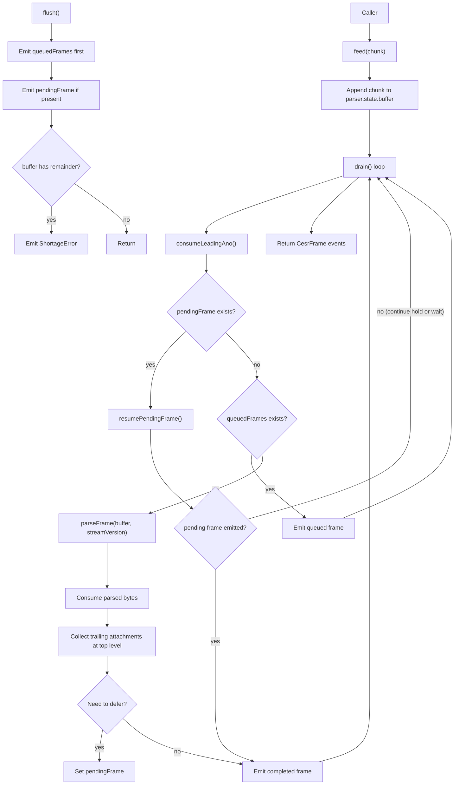
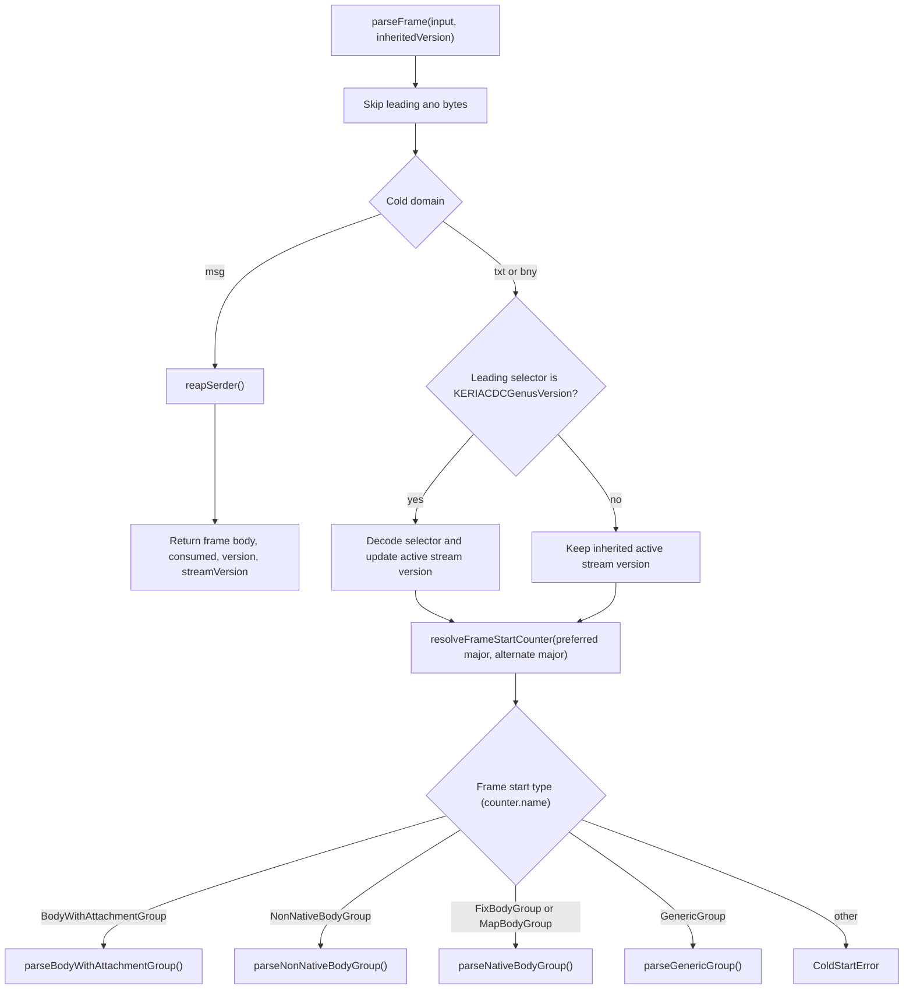
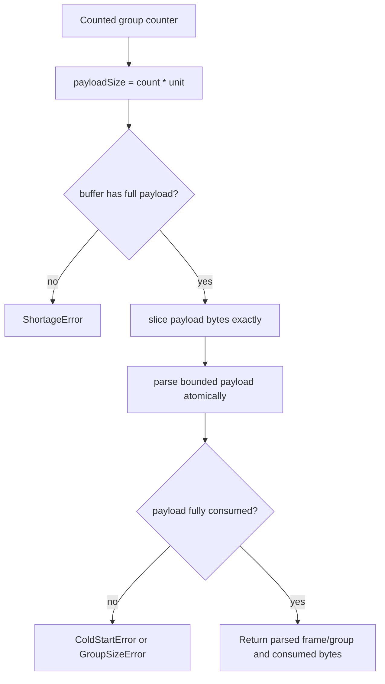
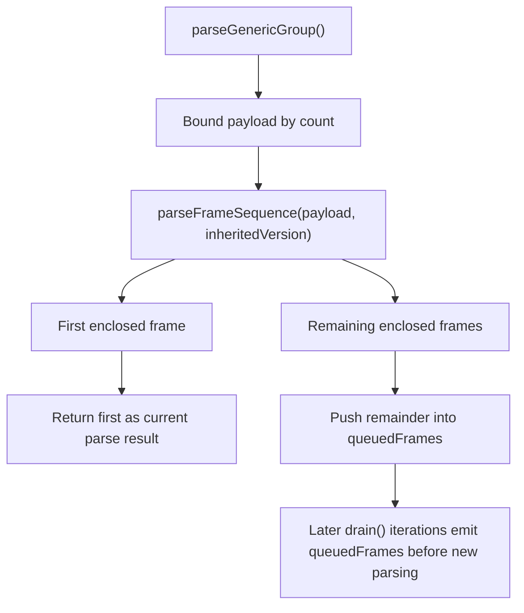
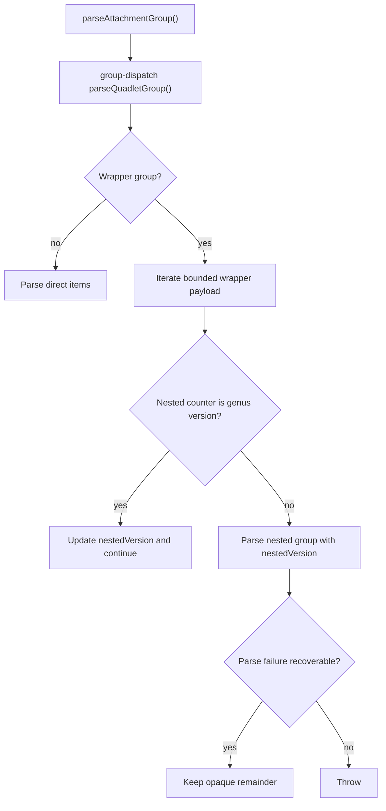
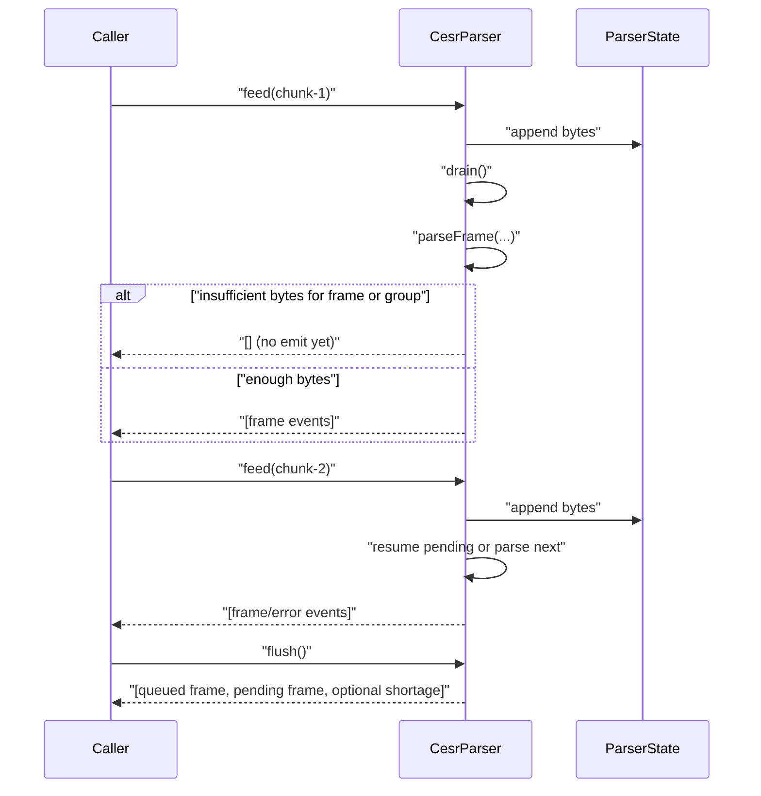
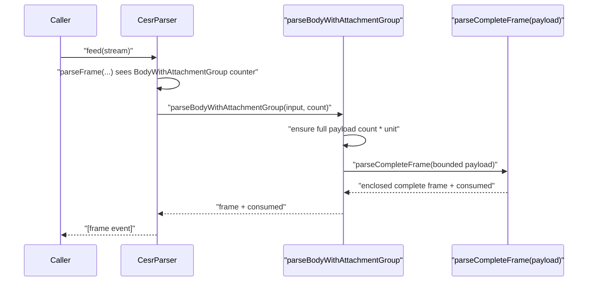

# CESR Atomic Bounded Substream Parser Architecture

## Purpose

This document explains how bytes move through the current `keri-ts` CESR parser
when using the intentional **atomic bounded substream** architecture.

Goals:

- make frame slicing and emission behavior explicit
- show where version context is applied
- show where nested counted groups are parsed atomically

Scope:

- `packages/cesr/src/core/parser-engine.ts`
- `packages/cesr/src/parser/group-dispatch.ts`

Canonical lifecycle contract:

- `docs/design-docs/CESR_PARSER_STATE_MACHINE_CONTRACT.md`

## Core Idea

For counted nested groups (`GenericGroup`, `BodyWithAttachmentGroup`,
`AttachmentGroup` wrappers), the parser:

1. waits until the counted payload bytes are available
2. parses that bounded payload as an atomic unit
3. emits complete frames (or deterministic shortage/error behavior)

It does **not** keep a resumable nested parse stack across chunk boundaries.

## Component Map

## Frame Start Parsing Contract

`resolveFrameStartCounter(...)` is intentionally counter-name based. It prefers
the inherited major version, then tries the alternate major if needed, and
accepts the first parsed counter when no frame-start name is found.

## Atomic Nested Group Boundaries

## GenericGroup Internal Behavior

## Attachment Wrapper Behavior

## Sequence: Chunked Top-Level Parse

## Sequence: BodyWithAttachmentGroup (Atomic Enclosed Parse)

## Version Context Model

There are three practical version scopes:

1. **Top-level stream scope**: `streamVersion`, updated by leading
   `KERIACDCGenusVersion` at frame start.
2. **Current frame attachment scope**: frame `version`, used when parsing that
   frame's attachment groups.
3. **Nested wrapper scope**: `nestedVersion` inside wrapper payload iteration in
   group dispatch.

This gives stack-like behavior via bounded function scope without a global
mutable nested parse stack.

## Emission and Deferral Rules

1. `queuedFrames` (from `GenericGroup`) are emitted before new parse work.
2. `pendingFrame` is used both for unresolved attachment continuation and for
   unframed no-lookahead holds after a complete body parse with no attachments.
3. `flush()` emits:
   - queued frames
   - pending frame
   - trailing `ShortageError` only if bytes remain in buffer

## When This Architecture Is Preferable

- parity-hardening and readability phase
- maintainability-first parser evolution
- minimizing nested resume-state complexity and bug surface

## When To Revisit

If production workloads require lower latency and progressive nested emission
for large counted groups, add an explicit incremental parser strategy as a
separate module/mode (per ADR-0001).
